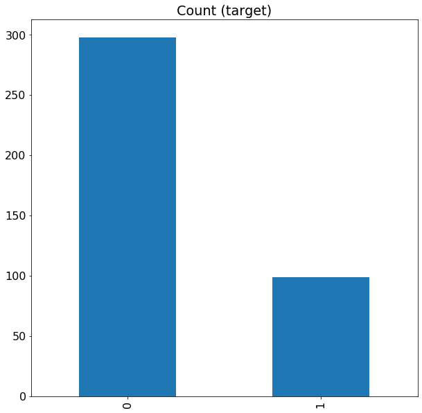
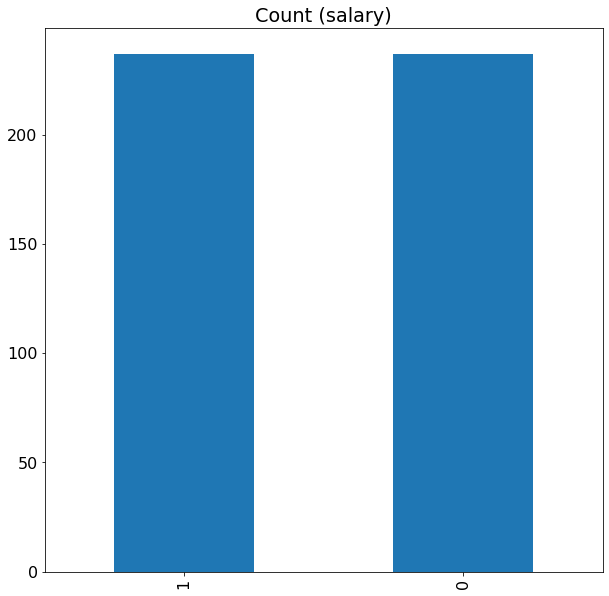

<h1> Imbalaced-Class-classification-by-model-Ensembling-of-Machine-Learning-Algorithm</h1>

<p1>The Purpose of this project is to build a classification predictive model, with the response being whether the salary is in the top quartile or not.
The steps that were taken in the modelling are:
  <ol>
    <li>
    Descriptive Analysis</li>
 <li>Data Visualization</li>
 <li>Data Preprocessing</li>
 <li>Inferential Analysis : Modeling
</li>
    </ol>
There are four quantitative variables in this dataset: 
 <ol>
    <li>nine-month salary</li>
    <li>years since Ph.D.</li>
    <li>years of service</li>
    </ol>
</p1>
We can deal with this imbalance class problem in a number of way. Such as:
<ol><li>Up-sample Minority Class</li>
<li>Down-sample Majority Class</li>
<li>Penalize Algorithms (Cost-Sensitive Training)</li>
<li>Change Your Performance Metric</li></ol>

After experimenting I am concluding that, considering the Up-sample of the minority class method for this Dataset is the best method.
Thus before the upsampling:
 Fig01: Before Upsampling</img>

After the up-sampling:
 Fig02: After upsampling</img>

The performance (accuracy of different method is described below):
<table style="width:100%">
<tr>
  <th>Alogorithm</th>  <th>mean of CV error</th> <th>variance of CV error</th></tr>
  
<tr><td>NN</td>               <td>0.725532    </td>         <td>    0.066911</td></tr>
<tr><td>LR  </td>               <td> 0.734043   </td>          <td>   0.058074</td></tr>
<tr><td>LDA   </td>          <td>  0.734043  </td>           <td>   0.049671</td></tr>
<tr><td>KNN  </td>          <td>  0.793617   </td>          <td>   0.047623</td></tr>
<tr><td>CART  </td>         <td>  0.861702  </td>           <td>  0.058074</td></tr>
<tr><td>NB   </td>          <td>   0.719149  </td>          <td>    0.036606</td></tr>
<tr><td>SVM   </td>        <td>  0.753191  </td>            <td>  0.046809</td></tr>

</table>
<p3>
One disadvantage of decision tree is it’s tendency to overfit. There are some strong modeling ensembles techniques and much more robust than a single decision tree. They aggregate many decision trees to limit overfitting as well as error due to bias and therefore yield useful results. The performance on the test sets for different algorithms are described here:
  
</p3>

The project is describes <a href="SalaryData_presentation_Ghosh_Mithun.pptx"> here </a>.

<h1>Author: Mithun Ghosh</h1>
<h2> Instruction to run the code:</h2>
</p2></p2>
